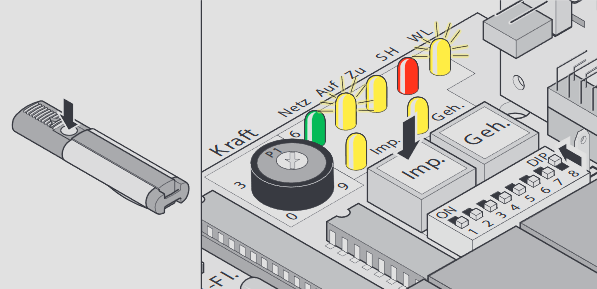
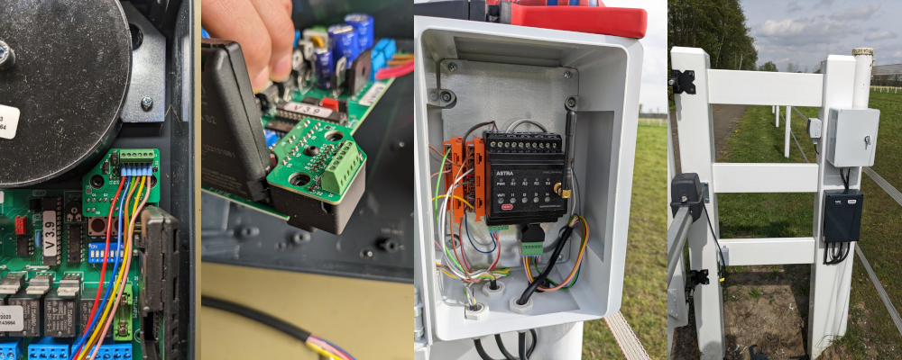

# Sommer Twist Automation
 Add-On PCB and ESPHome software to read gate state of Sommer twist 200 (and similar) to implement open and close commands

**Problem**:  Sommer Twist 200 (and similar) gate controllers only have an impulse-input. When toggling this input an open gate closes, closed gate opens and a moving gate stops. 
However, to integrate this into a smarter setup, distinct commands for _open_ and _close_ are needed. 

**Solution**: We read out the LEDs on the gate controller PCB which indicate whether the gate opens or closes, save the state and toggle the impulse-input, depending on the current state and the desired command. 

This solution needs no hardware hacks on the original Sommer controller. 
Find below the contents of the repository, BOMs for the read-out PCB and the overall system. 

## Contents of repository
* **SommerAdapter** KiCad Project of PCB. Basically implements opto-couplers using the LEDs on the Sommer gate controller. 
* **SommerAdapter-Mount** Fusion 360 Project and step files to mount PCB on Sommer controller. 
* **Setup** ESPHome YAML Script for ASTRA controller and wiring diagram. 
* **Gallery** Some pictures of the installation. 

## BOM SommerAdapter PCB Assembly

Parts for one PCB of SommerAdapter/SommerAdapter.kicad_pcb

Component Refs | Value      | Package | Qty | Reichelt #
-------------- | ---------- | ------- | :-: | ------------
C1 |	100n |	C_0603_1608Metric |	1 | KEM Y5V0603 100N 
R1, R2, R3, R4, R5, R6, R7 |	47k |	R_0603_1608Metric |	7 | SMD-0603 47K
D2, D7 |	PESD3V3S2UT | 	SOT-23 |	2 | PESD3V3S2UT 
D1 |	SS 16 |	D_SMA |	1 | SS 16 
D6 |	P4SMAJ5.0CA |	D_SMA |	1 | P4SMAJ5.0CA 
Q1, Q2, Q3, Q4, Q5, Q6, Q7 |	SFH309-5 |	LED_D3.0mm_Clear |	7 | SFH 309-5 OSO 
J1 |	DG308 | 2,54-6 | 1 | DG308 2,54-6 

## BOM Complete Setup

For presented setup to control a Twist 200. Of course you can make use of the PCB with some other microcontroller and software in your own setup. 

Component | Qty
-------------- | ---------- 
SommerAdapter PCB Assembly |	1
3D printed SommerAdapter-Mount/LowerPart.step  |	1
3D printed SommerAdapter-Mount/UpperPart.step  |	1
ASTRA controller, 4 Relays 16A, 4 AC Input, AC power, LED (BR4A4AL)  |	1
RJ12 6P6C adapter with screw terminals |	1
Panhead screw M3 x 10 |	1
Socket head screw M3 x 16 | 2
Lapp 1030243 LiYY PVC Control Cable 8 x 0.34 mm² |	~2m
Distribiution box 180x240x130mm IP65 F-ELEKTRO 5901087041915 |	1
Momentary switch Aquant 1207-65 IP65 |	1
DIN rail, mounting hardware, some Wago 221 and DIN rail adapter 221-500, 0.34 ferrules  | 

Some notes:
* The printed parts are designed for ABS. Other materials will probably work, too. 
* Keep the cable run for the SommerAdapter PCB as short as possible and avoid runs next to other cables. 
* Flash ESPHome to ASTRA controller and set to SPI mode. See [manual](https://templates.blakadder.com/assets/ASTRA_controller.pdf). Use SPI (left) RJ12 socket. We need the GPIOs and GND/3.3V to power our board. 
