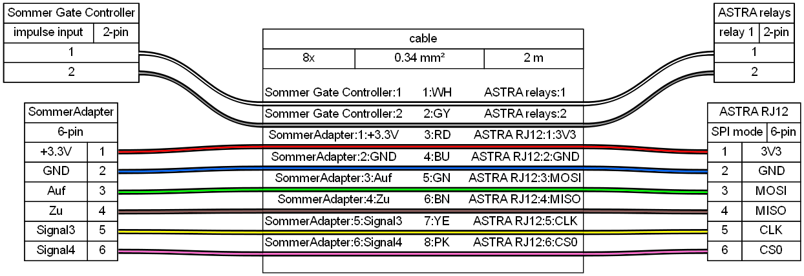

### Wiring diagram
of SommerAdapter only

In the presented setup ASTRA AC input 1 is connected to an induction looop, which triggers when a vehicle approaches. AC input 2 is connected to a momentary switch positioned at the gate. 

### ESPHome setup
ESPhome YAML file: astra-gate.yaml